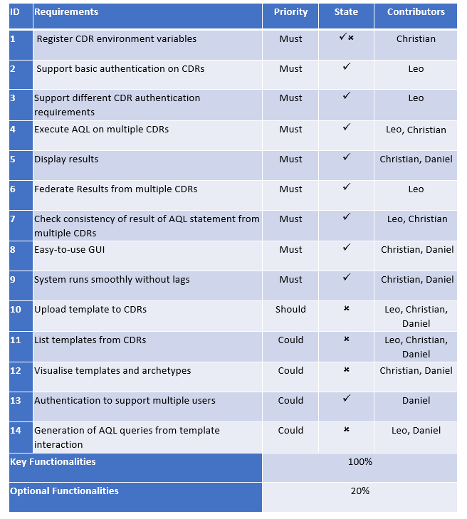

Evaluation
==========

Summary of Achievements
-----------------------

Achievements Table
~~~~~~~~~~~~~~~~~~

Contribution Table
~~~~~~~~~~~~~~~~~~
+-----------------------+-----------+-----------+-----------+
|Work Packages          |Leo        |Christian  |Daniel     |
+=======================+===========+===========+===========+
|Client Liaison         |34%        |33%        |33%        |
+-----------------------+-----------+-----------+-----------+
|Requirements Analysis  |34%        |33%        |33%        |
+-----------------------+-----------+-----------+-----------+
|Research               |34%        |33%        |33%        |
+-----------------------+-----------+-----------+-----------+
|UI Design              |30%        |35%        |35%        |
+-----------------------+-----------+-----------+-----------+
|Programming            |40%        |40%        |20%        |
+-----------------------+-----------+-----------+-----------+
|Testing                |60%        |20%        |20%        |
+-----------------------+-----------+-----------+-----------+
|Bi-weekly Reports      |15%        |15%        |70%        |
+-----------------------+-----------+-----------+-----------+
|Project Website        |20%        |10%        |70%        |
+-----------------------+-----------+-----------+-----------+
|Poster Design          |0%         |50%        |50%        |
+-----------------------+-----------+-----------+-----------+
|Video Editing          |0%         |45%        |55%        |
+-----------------------+-----------+-----------+-----------+
|Overall Contribution   |20%        |40%        |40%        |
+-----------------------+-----------+-----------+-----------+
|Main Roles             |Back-end,  |Front-end, |Editor,    |
|                       |Tester     |Research   |Front-end  |
+-----------------------+-----------+-----------+-----------+

Critical Evaluation of Project
------------------------------

User Experience
~~~~~~~~~~~~~~~
Our foremost focus was user experience. openEHR Explorer was created with unexperienced developers in mind who are likely to 
not yet be comfortable in the clinical field. We strongly believe that the GUI is very user-friendly and users of any skill
level will not find openEHR Explorer difficult to fully use.

Functionality
~~~~~~~~~~~~~
While we have achieved all of the essential features regarding the management and the querying of CDRs in general, we could
not complete the more complicated tasks specifically related to templates and archetypes.

Stability
~~~~~~~~~
The application itself functions without problems even if one or more CDRs in the list is unaccessable or down. The UI is robust
and is highly unlikely that a user will be able to directly cause problems that will affect the stability of the system.

We have used Electron to develop the application - this ensures that it can be used cross-platform. An executable file can be 
created to easily distribute the software whenever necessary.

Efficiency
~~~~~~~~~~
The simple-yet-straightforward UI means that the user will have a clear idea of what needs to be done and how to carry out the
actions that he desires to do. In extreme situations, a developer could change the application's file system to be executed
asynchronously if the need rises for reasons such as an exceptionally long configuration file of CDRs.

Maintainability
~~~~~~~~~~~~~~~
TDD ensures that as much of the testable code is covered by unit tests, reducing the chance of errors and exceptions rising in
the future when the codebase is likely to have expanded.

Comments have been written within the code in parts where we believe it could cause confusion for any future developers who are 
looking at the code.

Version control has been used since the beginning of the project and versions can be tracked back. Branches were used in situations
where more than one person contributed to the code to minimise conflicts when developing concurrently.

The back-end was developed independantly from the front-end so that future developers would be able to incorporate their own libraries
or user interface from or into the current openEHR Explorer ecosystem.

Project Management
~~~~~~~~~~~~~~~~~~
We had clearly communicated with each other from the very beginning to know each member's strengths and weaknesses. Tasks were 
allocated so that all the members did not feel they were unjustly overcumbered.

Over time, we had formed strong friendships with each other and the team was able to bond exceptionally well. When Leo McArdle had
to leave due to personal health considerations, the remaining members - albeit devasted - did their utmost best to fill the gap and
carry out any tasks yet undone without lowering the standard.

Future Work
-----------
The team recognises that openEHR Explorer has yet to reach its full potential and that there are features that would be greatly
valued but are yet to be implemented into openEHR Explorer.

The missing aspect of openEHR Explorer with the greatest significance is the lack of features regarding templates - from uploading
templates into CDRs to the listing templates from multiple CDRs. The client had mentioned briefly that the ultimate goal eventually for 
openEHR Explorer is to be able to create AQL queries by interacting with the templates belonging to CDRs as AQL is not a language
that is widely used and is quite specialised - new developers in the clinical field often struggle. This means that the system
will need to have features regardng templates in order to reach its future goal. However, the client has also noted that 
visualisation of templates is a very difficult task to manage and that it is not absoluely necessary as users will eventually become
comfortable with AQL queries.

Nevertheless we were not able to implement any features regarding templates in the given timeframe, but we believe that if 
further time was given, it would be possible to integrate template functionalities into openEHR Explorer and bring the system 
closer to its ultimate goal of being able to build AQL queries by templates which would greatly lower the difficulty of querying
CDRs.

Other possible future implementations include:
- Finer authentication system
- More robust user identification system
- Friendlier method of sorting and selecting CDRs to query
- Deleting multiple CDRs at once
- Allowing user to alter the layout of openEHR Explorer
- More extensive use of the top navigation bar
- Export the generated table to a saveable file