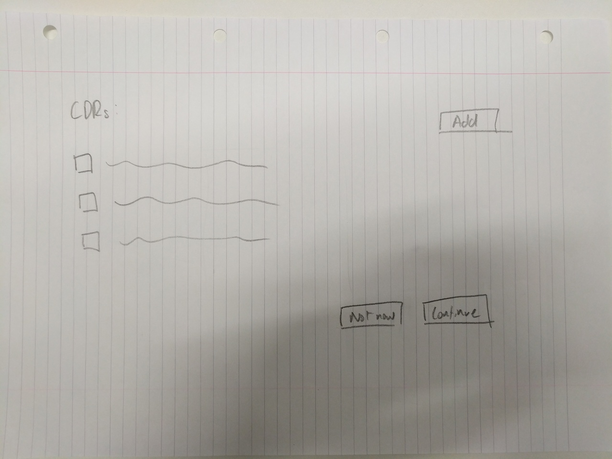
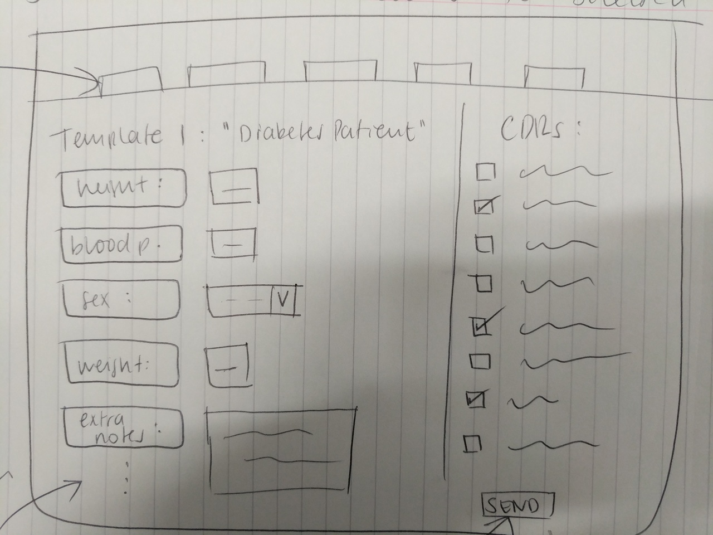
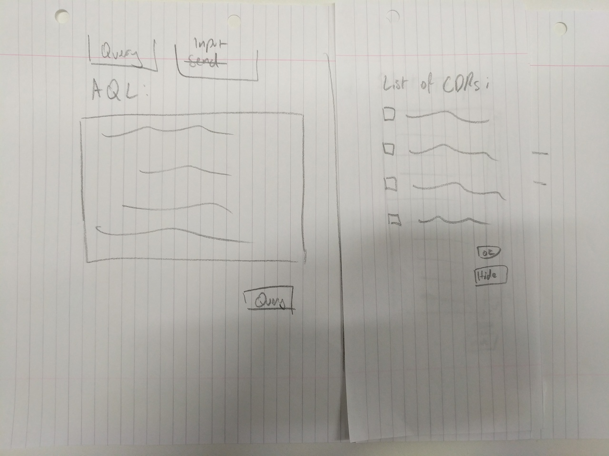
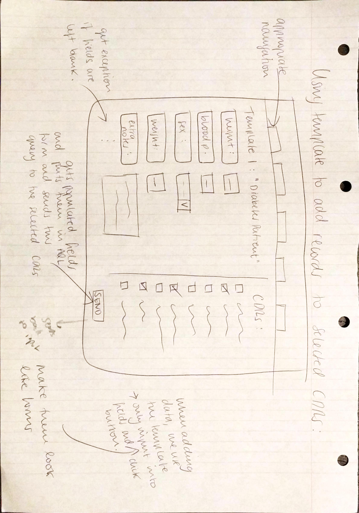
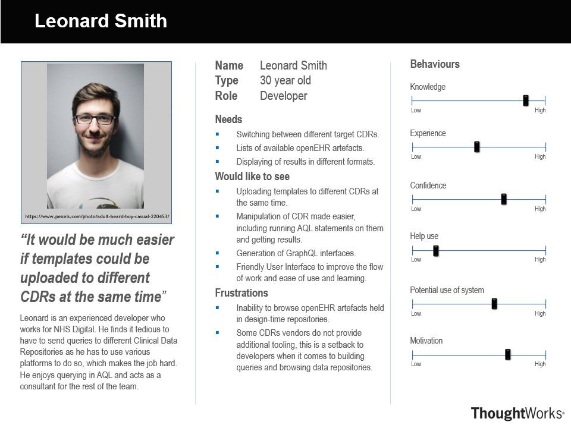
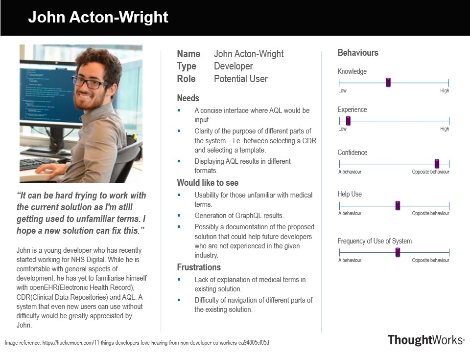
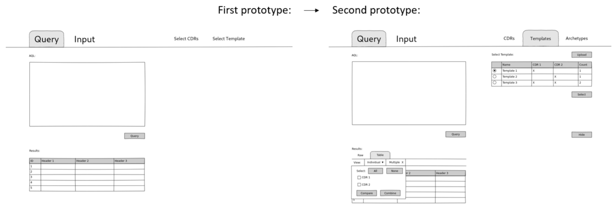

HCI - Human Computer Interaction
================================

Design Principles
-----------------
Ben Shneiderman outlines that there are eight design principles of HCI[1]. The team has decided to adopt some of the principles
of Shneiderman that we believed to be particularly important. This section will explore how the principles affected the team's 
implementation of the HCI:

- Consistency

 - Our system has a universal theme/layout which prevents from causing confusion for a first time user.

- Shortcuts for frequent users

 - While a simple and consistent design provides advantages for new users, frequent users may find this to be repetitive in 
 certain parts of the system. We have therefore minimised screen movement in our system to allow the user to carry out similar
 tasks in quick succession.

- Easy revesal of actions

 - It is always possible that even an experienced user will carry out an incorrect action, and being able to easily revert any
 changes in the system will provide relief for the user - for example in openEHR Explorer, a wrong CDR might be added; 
 we have therefore allowed the user to easily remove any CDRs that is unnecessary/incorrect.

- Reduce short-term memory load

 - 'limitation of human information processing in short-term memory requires that displays be kept simple' - the team has followed
 Shneiderman's statement and has reduced multiple page displays as much as possible, condensing the crucial functions of the system
 to be contained within a single page.

Initial Sketches
----------------
After we had gathered the requirements from the client and the users, we started sketching possible solutions prior to the creation of the first iteration of a prototype individually to increase the chances of each member devising a unique solution.
Once the sketches were completed by all three members, we compared the results to come up with a version that we used to create the first iteration of the prototype.

+-----------+-----------+
| |sketch1| | |sketch2| |
+-----------+-----------+
| |sketch3| | |sketch4| |
+-----------+-----------+

Personas Created
----------------
The team created two personas. The personas helped the team to come up with a HCI that would be enjoyed by a range of users.

* The first persona is of an experienced developer

* The second persona is of a developer who is not yet familiar with the medical industry.

Interactive Wireframe
---------------------

https://projects.invisionapp.com/share/V9OIKT03CQS#/screens/325133873_Select_Cdr

First Iteration
~~~~~~~~~~~~~~~

From the gathrered requirements and the sketches produced, we were able to create our first iteration of a prototype:

.. image:: images/sketchToProto.png

Feedback
________

After we had completed the first prototype of the HCI, we allowed our potential users to experiment with it and give feedback on the first version.

.. image:: images/feedbackOne.png

Then, the group once again drew further sketches on a section of the solution that we had previously missed out - manipulation and the visualisation of the results data.

Second Iteration
~~~~~~~~~~~~~~~~

Using the feedback and the new set of sketches, we were able to build upon the first prototype to expand its features.

References
----------
- [1] Ben Shneiderman, 'Shneiderman's "Eight Golden Rules of Interface Design"', 12th September 2013 [Online] https://www.designprinciplesftw.com/collections/shneidermans-eight-golden-rules-of-interface-design
