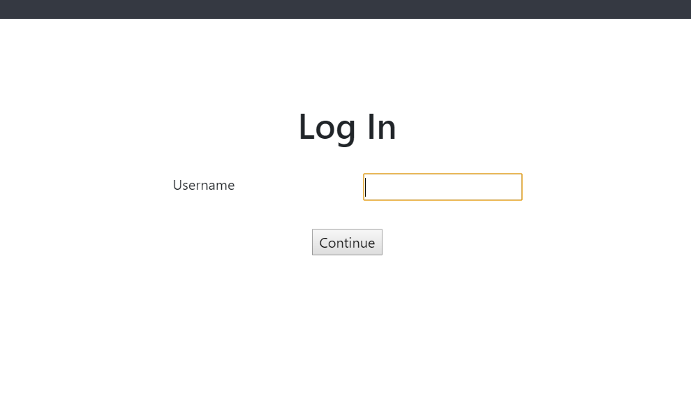
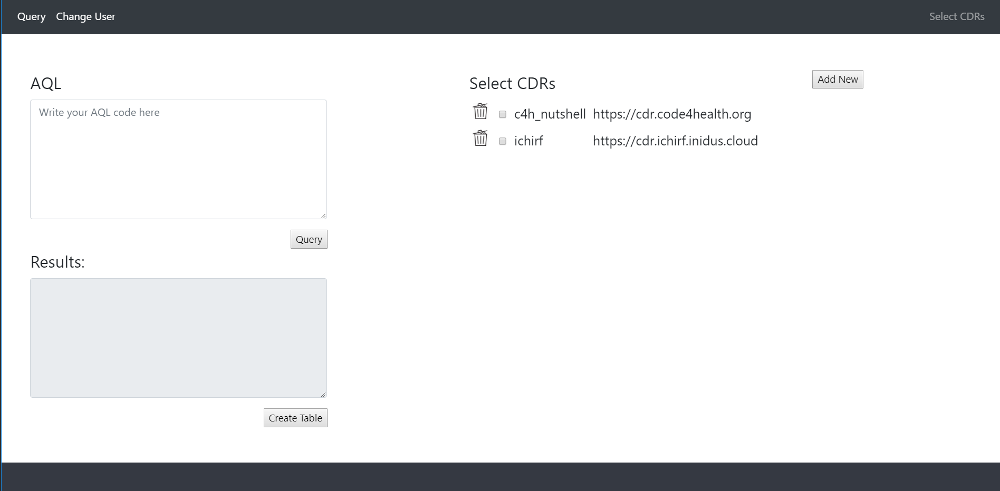
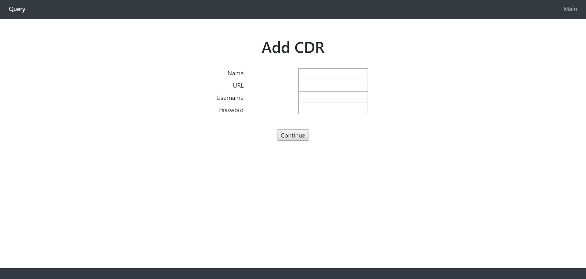
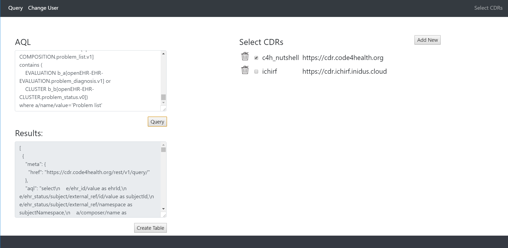
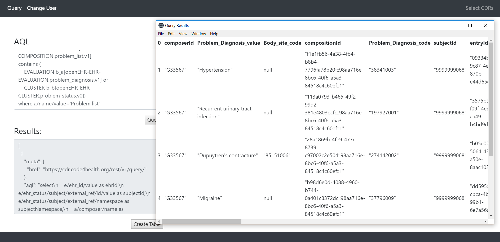

Management
==========

Legal Issues
------------
Download the Legal Issues Document `here <https://liveuclac-my.sharepoint.com/:b:/g/personal/zcablgp_ucl_ac_uk/EVX-dzc90A1Osins47AWgcgB7BxF9VSGvsHVfkyFQvbQCg?e=ad1LFT>`_.

User Manual
-----------
Logging in
~~~~~~~~~~

When the application is opened, you will be greeted with the login screen:

Enter any name you wish(Case sensitive, Whitespace sensitive) and click the 'Continue' button.

You will then be transferred to the main page:

Manage CDRs
~~~~~~~~~~~

After logging in, you can add a new CDR to the list clicking the 'Add New' button, which will transfer you to the addition page:

Fill in the details and press 'Continue'. This will add the CDR to the list and automatically save the changes to the configuration
file, saving the list for use at another time. The text boxes will be emptied so allow you to add additional CDRs.

To return to the main page, click on the 'Main' button on the right of the top navigation bar.

CDRs can be removed from the list by clicking on the bin image next to the CDRs.

Querying
~~~~~~~~

In the main page, you can query one or more CDRs from the list by clicking and selecting the corresponding boxes.

Enter AQL in the top left textbox and click the 'Query' button to execute the AQL. The results will be returned as a JSON tree, shown below:

Clicking on the 'Create Table' button will generate a table from the JSON tree and display it on a new resizeable window:

Deployment Manual
-----------------
1. Clone repository from GitHub - `found here <https://github.com/ucl-openehr-explorer/electron-app>`_.
2. Go to the repository in command line (e.g. Windows - cmd, Unix - Bash, etc.)
3. Ensure npm is installed. To check, enter
::

    npm --version

*If not installed, download* `NodeJS here <https://nodejs.org/en/>`_.

4. Run the following commands:
::

    #install dependencies
    npm install
    #starts the app
    npm start

For instructions in greater detail, please refer to the README.md in the GitHub repository.

Gantt Chart
-----------

Add Gantt Chart here