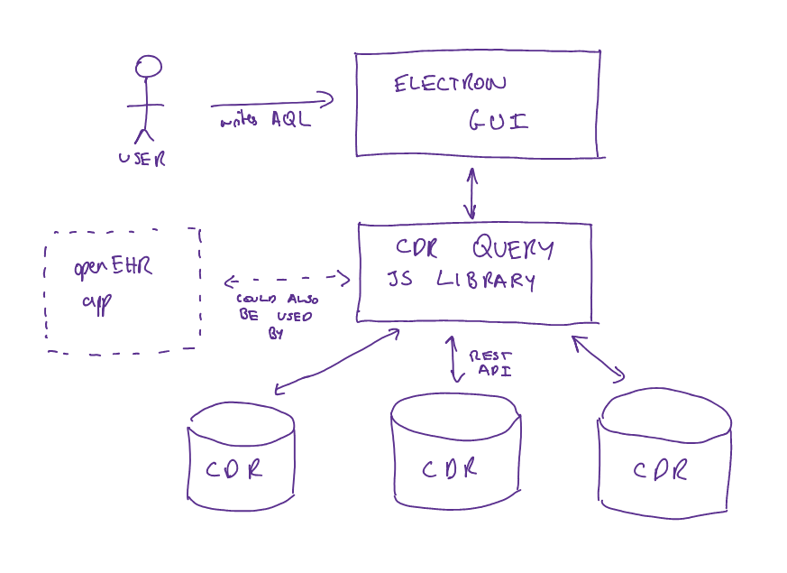
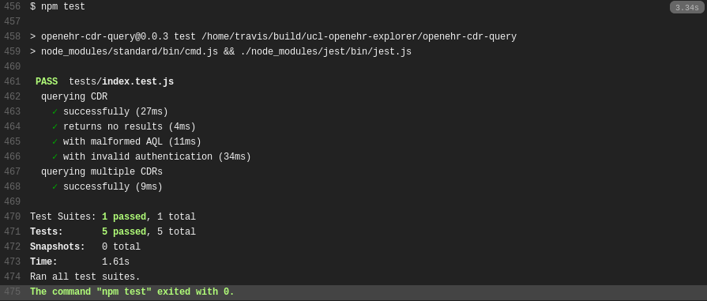
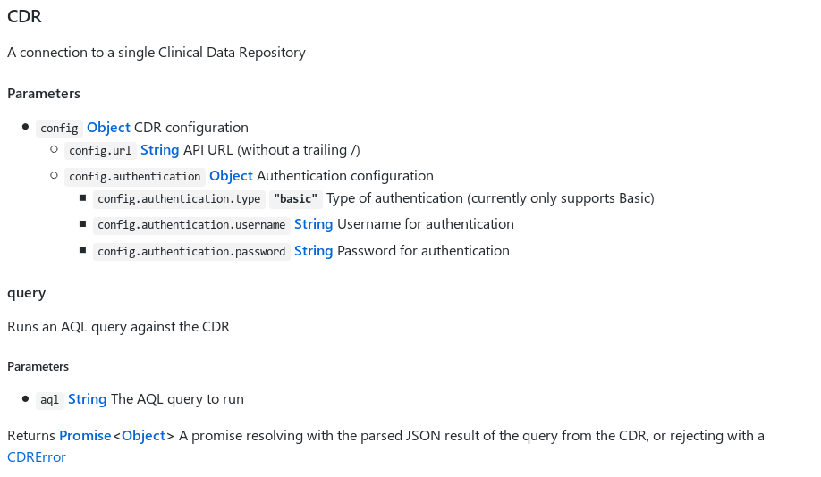
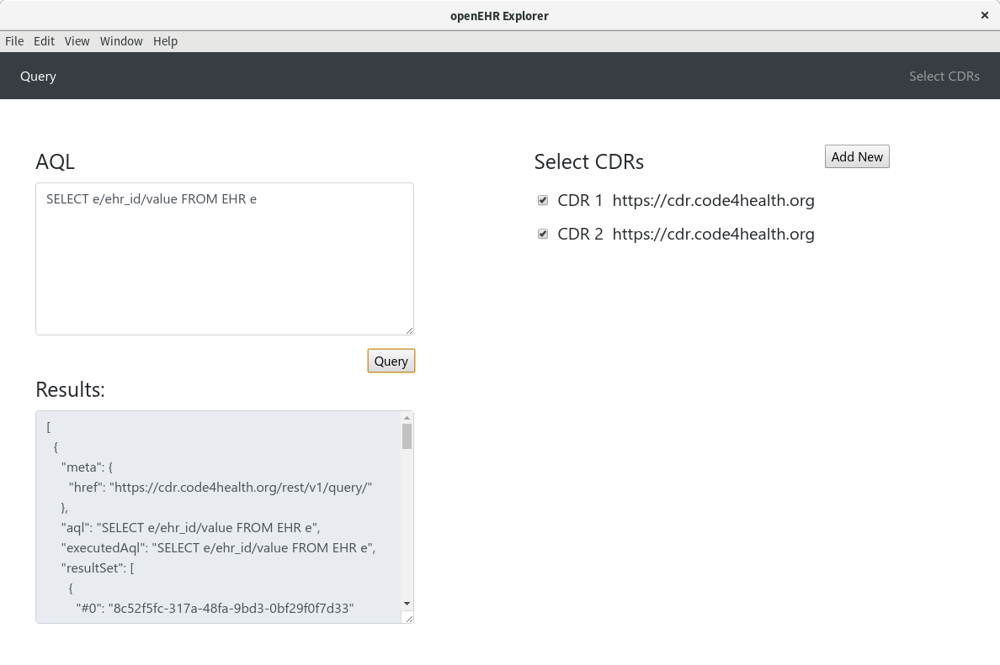

First Prototype
===============

System Architecture
-------------------

We decided to separate out the project into two components to make developing them concurrently easier, to make testing easier in isolation, and finish the project with deliverables which are maximally useful to the openEHR ecosystem.

CDR Query Library
-----------------

`Initial prototype source code <https://github.com/ucl-openehr-explorer/openehr-cdr-query/tree/eba929b8cc92a45b6cded642a9457be24b78d95a>`_.

To handle retrieving data from CDRs, federating it, and committing new data to CDRs. In this initial prototype all that the library is able to do is send an AQL query to one or multiple CDRs, and concatenate their results.

However it's been built with modern development practices, which makes extending this functionality incredibly simple:

- We followed a test driven development methodology, so the code is thoroughly tested:

- We used JSDoc and documentation.js to generate extensive API documentation for the code:

- We used the latest and greatest additions to JavaScript (ES6 modules, Promises, the Fetch API, among others), utilising Babel to make them backwards compatible with older JavaScript engines and versions of Node.js

By building this library in isolation from the Electron app, we give developers in the openEHR ecosystem the option of incorporating this library into their own projects.

While in its prototype phase it only runs in Node.js, with only a little work it could be made to work in the browser too.

Electron App
------------

`Initial prototype source code <https://github.com/ucl-openehr-explorer/electron-app/tree/aee92465da20285038f4539700db745d0bb454dd>`_.

The Electron app utilises the CDR Query Library to provide a GUI which users can use to query CDRs.

In this initial prototype, users can add CDRs, send an AQL query to a subset of them, and get the raw data back.
