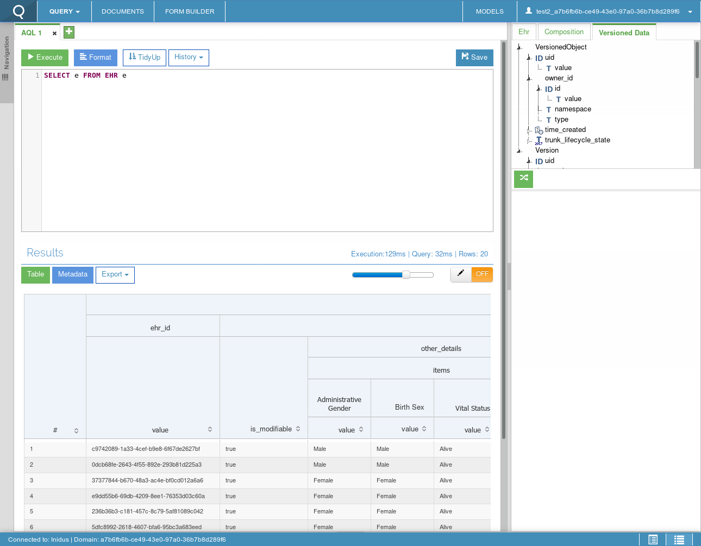

Research
========

openEHR
-------

Much of our research centred around understanding the openEHR ecosystem. Our client was an invaluable resource in this, 
taking the time to explain its concepts and elements to us. We also did some research of our own, from information 
avaiable online:

- https://www.openehr.org/what_is_openehr
- https://specifications.openehr.org/

  - https://specifications.openehr.org/releases/QUERY/latest/AQL.html
  - https://openehr.github.io/specifications-ITS-REST/
  - https://www.ehrscape.com/api-explorer.html

Existing solutions
------------------

Our client gave us access to a similar proprietary tool to the one we'd be building, Think!EHR Explorer.

We tested the tool to get a feel what what potential users would be used to. Crucially we had to go beyond what this tool did, 
and make a tool capable of querying multiple CDRs concurrently.

Technologies
------------

Languages
~~~~~~~~~

We settled upon JavaScript since all members of our team had used it in the past or were familiar with it, 
and our client had recommended doing it this way.

We chose against making a browser-based webapp because CORS could have posed a problem, 
with some CDRs not being configured correctly to be queried from a browser. 
So instead we decided to use Electron where this wouldn't pose a problem. 
It also means we can create executable files which can be distributed to users. 

We also decided to incorporate elements of modern JavaScript such as ES6 modules, 
Promises and the Fetch API, to build our project in a forward-thinking way.
While some of these features aren't implemented in Node.js today,
`they will be soon <https://medium.com/@giltayar/native-es-modules-in-nodejs-status-and-future-directions-part-i-ee5ea3001f71>`_,
and we can `convert code written using them into JavaScript which current versions of Node.js can run using tools like Babel <https://hackernoon.com/7-different-ways-to-use-es-modules-today-fc552254ebf4>`_.

Test Frameworks
~~~~~~~~~~~~~~~

Given the extent of research done in this article, we took its advice and looked into using Jest for our 
JavaScript unit tests: https://medium.com/welldone-software/an-overview-of-javascript-testing-in-2018-f68950900bc3

Its documentation showed it to be a powerful testing framework, and when using it we found it very pleasant.

For mocking HTTP requests and responses in our tests we found `Nock <https://github.com/nock/nock#readme>`_. 
Nock is particularly powerful because it allows one to run a real HTTP request in a test, save the response, and then 
use those saved values in tests going forward. This is especially useful given our need to test querying against a complex 
external API, where manually running the queries and copying the result over would be too tedious and error prone.

Documentation Generators
~~~~~~~~~~~~~~~~~~~~~~~~

`JSDoc <http://usejsdoc.org/>`_ is the standard for annotating JavaScript code with documentation, 
and we decided on using `documentation.js <https://documentation.js.org/>`_ to turn that into readable documentation 
given its ease of use with minimal configuration.
