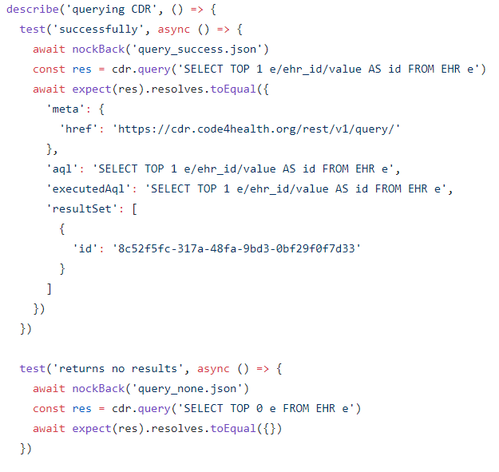
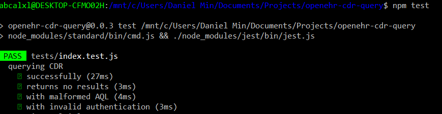

Testing
=======

Testing Strategy
----------------
From the beginning of the development of the back-end, we have followed the TDD methodology to ensure high coverage of the code.
This will also help us create unit and integration tests.

We have used Jest - a testing framework developed and maintained by Facebook[1]. It is open-source and has become increasing popular
over the last few years. Jest's primary advantage is that it works 'out of the box' without any configuration and it is very 
simple to use.

Nock has been used to simulate/mock HTTP requests and responses as mentioned in Research.

Unit and Integration Testing
----------------------------
The TDD methodology has meant that thorough unit and integrations have been written during development. The integration tests
have been created as a composition of multiple unit tests that we seemed belonged together as a part of a group. For example, unit
tests that are querying CDRs have been grouped and can be performed in a series - below shows a snippet of the test of openEHR Explorer:

Below shows an example of the above tests being run in a sequence.

Automated Testing
-----------------
Naturally, following the TDD methodology has given way to test automation. They can be run quickly through Jest and can be repeated
many time without difficulty. 

User Acceptance Testing
-----------------------
User acceptance testing is especially important as a system which the user and the client are not satisfied with will see very little
use even if the system has thorough functionality testing. We have therefore given great attention to constantly receive feedback from
our expected users and client.

Our client is distinct from other usual clients in that the client will also be a user. Therefore our client was able to provide views of
openEHR Explorer both as a client and an user which is invaluable. We believe this has also significantly reduced the time taken of
the user acceptance testing.

Each week we updated our Teaching Assistant in laboratory sessions and our client and users through a combination of slack.
The continuous stream of feedback we were able to received contributed greatly in building our system to meet with their requirements
and create a software that is up to expectations. Positive and negative feedback was given each time along with advices which
the team took into consideration whenever an element was being edited.

Feedbacks have been mostly positive - the GUI and the querying has both been approved by the users. However, there are parts in
openEHR Explorer that are less developed and has been mention and talked with the client. These will be mentioned in Evaluation.

References
----------
1. https://jestjs.io/